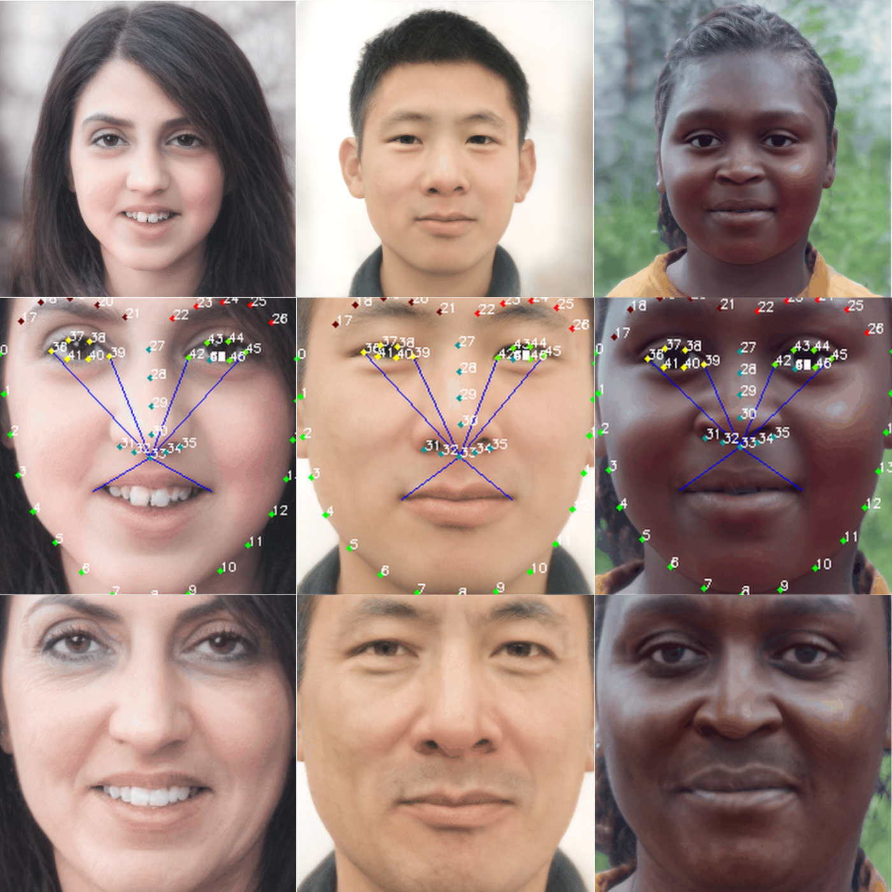

# futura-face

**Picture:** *The images illustrate how the system analyzes faces by detecting key points using dlib, with a future application utilizing the k-NN algorithm for facial recognition and comparison.*

**Abstract:** *This Git repository presents a proposal for developing a web application for facial image analysis. The application will provide a future approach by comparing the user's image with a dataset of facial images, facilitating the verification of individuals in missing person situations or the identification of finite and intact bodies for forensic services.*

## Resources

Material related to our project is available via the following link:

Dataset: https://drive.google.com/drive/folders/1QCd2XWPxo-lq5-HPu-VdQAfacYTy4IpZ?usp=drive_link

## Testing

The facial dataset was divided into training and testing groups as detailed below to evaluate the system's accuracy.

### Dataset Split
- **Total Instances:** 5000
- **Training Instances:** 3500
- **Testing Instances:** 1500

The testing instances correspond to ages 30, 50, and 70, including both men and women, with the remaining images allocated to the training set.

### Prediction Criteria
A prediction is considered correct when the names of the folders of the nearest neighbors match the folder of the test image.

### Evaluation Results
The following analysis presents the evaluation results of a classification model based on the K-Nearest Neighbors (KNN) algorithm, considering a range of 0 to 5 neighbors.

| Metric      | k1      | k2      | k3      | k4      | k5      |
|-------------|---------|---------|---------|---------|---------|
| Accuracy    | 49.89%  | 62.53%  | 69.59%  | 75.06%  | 79.46%  |
| Recall      | 43.46%  | 56.60%  | 64.86%  | 70.26%  | 74.13%  |
| F1-score    | 41.87%  | 55.31%  | 63.61%  | 69.24%  | 73.16%  |

## Acknowledgements

We would like to express our heartfelt gratitude to Dr. Benjamín Cruz Torres and Dr. José Félix Serrano Talamantes for their invaluable guidance and support throughout the development of this project. Their expertise and insights have been instrumental in shaping our approach and ensuring the success of our work.
